# 📊 Monte Carlo Molecular Simulation (Metropolis Algorithm)

This project simulates a molecular system using the Metropolis Monte Carlo algorithm with a Lennard-Jones potential in a 3D box with periodic boundary conditions. It also provides a Streamlit-based UI for interactive experimentation with simulation parameters, real-time visualization, and result export.

---
## 📁 Project Structure

# 📊 Monte Carlo Molecular Simulation (Metropolis Algorithm)

This project simulates a molecular system using the Metropolis Monte Carlo algorithm with a Lennard-Jones potential in a 3D box with periodic boundary conditions. It also provides a Streamlit-based UI for interactive experimentation with simulation parameters, real-time visualization, and result export.

---

## 📋 Table of Contents
- [Project Overview](#-project-overview)
- [Features](#-features)
- [Methodology](#-methodology)
  - [Lennard-Jones Potential](#lennard-jones-potential)
  - [Metropolis Monte Carlo Algorithm](#metropolis-monte-carlo-algorithm)
- [Workflow Diagram](#-workflow-diagram)

## 🔭 Project Overview
This project simulates `N` particles interacting in a cubic box. The core of the simulation relies on the Lennard-Jones (LJ) potential for particle interactions and the Metropolis algorithm for accepting or rejecting new particle configurations. The entire simulation is wrapped in an easy-to-use Streamlit interface for interactive analysis...

Key physical concepts implemented:
-   Random particle displacements
-   Periodic Boundary Conditions (PBC) to simulate an infinite system
-   Metropolis acceptance criteria for statistical mechanics

## ✨ Features
-   ✅ **Periodic Boundary Conditions:** Accurately simulates a particle system in a repeating volume.
-   ✅ **Live Energy Tracking:** Plots the total energy of the system at each Monte Carlo step.
-   ✅ **3D Visualization:** Generates a 3D scatter plot of the final particle configuration.trajectory.
-   ✅ **Modular Codebase:** Clear separation between the core simulation logic and the user interface.

## 🔬 Methodology

### Lennard-Jones Potential
The interaction between non-bonded particles is modeled using the Lennard-Jones (LJ) potential. This potential describes how particles attract each other at moderate distances and strongly repel at very short ranges. The potential energy $U$ between two particles separated by a distance $r$ is given by:

$$U(r) = 4\epsilon \left[ \left(\frac{\sigma}{r}\right)^{12} - \left(\frac{\sigma}{r}\right)^6 \right]$$

For simplicity, this simulation uses reduced units where $\epsilon$ and $\sigma$ are set to 1.

### Metropolis Monte Carlo Algorithm
The simulation evolves the system state using the Metropolis algorithm. This ensures that the system properly samples the Boltzmann distribution for a given temperature.

The step-by-step process is as follows:
1.  **Initialize**: Randomly place `N` particles in a 3D box, ensuring a minimum distance between them to avoid unphysical overlap.
2.  **Compute Initial Energy**: Calculate the total potential energy of the initial configuration using the Lennard-Jones potential.
3.  **Start Monte Carlo Loop**: For each step in the simulation:
    a. Randomly select one particle.
    b. Propose a move by displacing it by a small, random amount.
    c. Apply periodic boundary conditions to keep the particle inside the primary simulation box.
    d. Calculate the change in energy, $\Delta E$, resulting from the move.
    e. **Accept or Reject the move** based on the Metropolis criterion:
        - If $\Delta E < 0$ (the move lowers the system's energy), **always accept** it.
        - If $\Delta E \ge 0$, accept the move with a probability of $p = \exp(-\beta \Delta E)$, where $\beta = 1/k_B T$.
    f. If accepted, update the particle's position and the system's total energy. If rejected, revert to the old state.
4.  **Save Data**: Periodically save the system's energy, particle positions (trajectory), and other metrics for analysis.

## 🧭 Workflow Diagram

```mermaid
graph TD
    A[Start] --> B[Initialize particle positions];
    B --> C[Compute total initial energy];
    C --> D{Begin MC loop};
    D --> E[Randomly select particle];
    E --> F[Displace particle randomly];
    F --> G[Apply periodic boundary];
    G --> H[Compute ΔE];
    H --> I{"ΔE < 0 or P < exp(-βΔE)?"};
    I -- Yes/Accept --> J[Update position and energy];
    I -- No/Reject --> K[Keep old state];
    J --> L[Save configuration periodically];
    K --> L;
    L --> M{End of Loop?};
    M -- No --> D;
    M -- Yes --> N[End Simulation];
```
